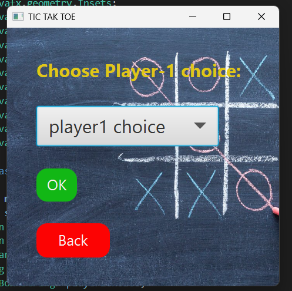
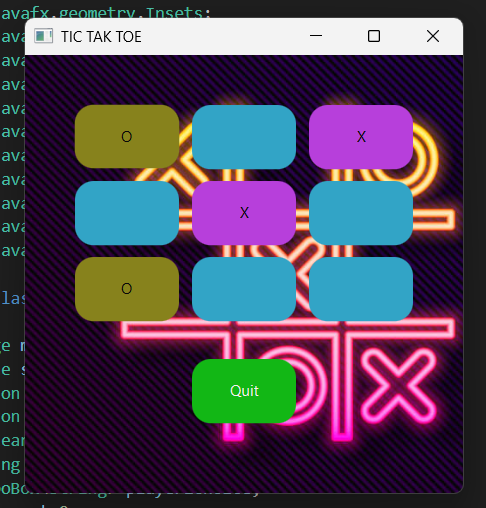
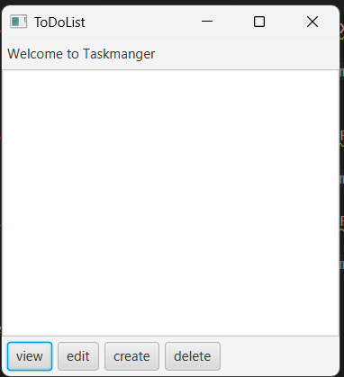
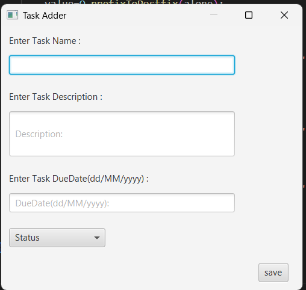
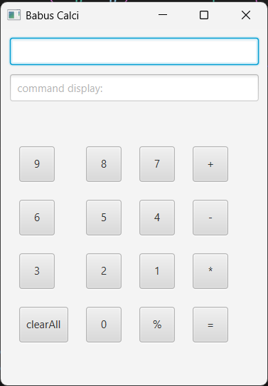

# JavaFX Projects Collection 🎯

This repository contains three beginner-to-intermediate level **JavaFX projects**, each built using **Maven**. These projects showcase UI design, interactivity, and JavaFX styling techniques:

- ✅ Tic Tac Toe Game
- ✅ Task Manager Application
- ✅ Basic Calculator

---

## 📁 Project Structure

```
.
├── TicTakToe.java          # A classic 2-player game with JavaFX UI
├── ToDoList1.java         # A basic task tracking app with CRUD features
└── Calculator1.java         # A simple calculator with GUI
```

Each folder is a standalone Maven JavaFX project.

---

## 🚀 Live Demo Videos

| Project         | Demo Video |
|----------------|------------|
| **Tic Tac Toe** | [🎥 Watch](https://drive.google.com/file/d/1puBu2vikLZRN3SPVAHloVpibnBeH9YEg/view?usp=sharing) | 
| **Task Manager**| [🎥 Watch](https://drive.google.com/file/d/1kMmWDsZ8c4wbG8ZROqSYqVb9dn4NPR8u/view?usp=sharing) |
| **Calculator**  | [🎥 Watch](https://drive.google.com/file/d/1oBa3njKRfgZ8u52LO_kg_i72Y1wmnQsV/view?usp=sharing) |

---

## 📌 Technologies Used

- Java 11+
- JavaFX (via OpenJFX)
- Maven for dependency management
- CSS for JavaFX UI styling

---

## 🔧 How to Run Each Project

1. **Clone the repository:**
   ```bash
   git clone https://github.com/nagachaitanyababusiga/CalculatorTicTakToeTaskManangeUsingJFX.git
   cd CalculatorTicTakToeTaskManangeUsingJFX
   ```

2. **Run using Maven:**
   ```bash
   mvn clean javafx:run
   ```

> ✅ Make sure `JAVA_HOME` is set correctly and JavaFX modules are configured if needed.

---

## 📷 Screenshots


### Tic Tac Toe




### Task Manager



### Calculator



---

## 🙌 Acknowledgements

These projects were built as part of learning JavaFX and Java GUI development. Contributions, ideas, and improvements are always welcome.

---

## 📬 Contact

**S. NagaChaitanyababu**  
💻 GitHub: [Nagachaitanyababu](https://github.com/nagachaitanyababusiga)  
📫 Email: nagachaitanyababusiga@gmail.com
